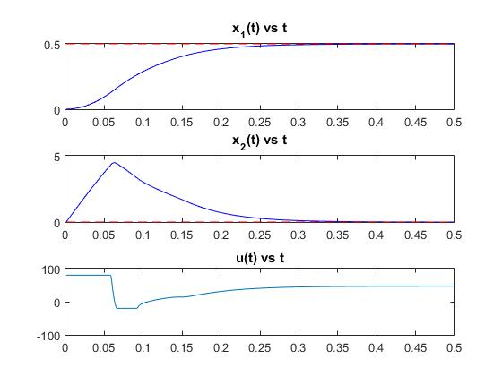

# Tutorial on Linearized MPC controller

This is tutorial of Linearized MPC controller for nonlinear system. In this tutorial basic parts of Linearized MPC controller would be examined. This script shows how to implement controller for nonlinear system provided by equation **dx/dt = f(x,u)** and **y=C*x+D*u**. For details of derivation please refer to  Zhakatayev, Altay, et al. "[Successive linearization based model predictive control of variable stiffness actuated robots.](http://ieeexplore.ieee.org/document/8014275/)" IEEE AIM 2017

## Problem statement
MPC controller requires several parameters:
`np` - horizon length
`Q`  - matrix representing relative importance of states (also we use vector 'wx')
`R`  - matrix representing penalizing large values in control inputs ( vector 'wu')

Model Predictive Control scheme can be formulated as an optimization problem with horizon length $$np$$:
 
$$ \min\limits_{ u } J = \frac{1}{2}(X-rr)^TQ(X-rr) + \frac{1}{2}u^TRu = \frac{1}{2}u^TGu + f^Tu + C $$

subject to:

$$ A_{con} u \leq B_{con}$$ 

$$ X = [x(1),x(2),...,x(np)]^T $$

$$ x(k+1) = f(x(k),u(k))$$

In order to solve this problem MATLAB built-in quadprog() function is used. Please refer to documentation of quadprog() function for details.
In fact, any nonlinear optimization problem solver can be used to come up with a solution. For example, qpOASES is suitable for real-time operation of robotic systems.

## Tutorial objectives
This tutorial covers implementation of basic parts of MPC controller. They are:
1. Linearization of model 
2. Discretization of linearized model
3. solving MPC controller optimiation problem with simple constraints

We setup out tutorial on simple mathematical pendulum, with equation of motion:

$$\frac{\partial x_1}{\partial t} = x_2 $$ 

$$\frac{\partial x_2}{\partial t} = -\frac{g}{l} sin(x_1) -b*x_2 + u $$

Following MATLAB code shows how do we implement MPC controller:

<pre>
<code class="matlab">
close all; clear; clc;

% global parameters associated with dynamic model of the system 
global g; g = 9.81;  
global l; l = 0.1;  
global b; b = 0.2;  

% this is matrices to represent output as y=C*x+D*u
C = eye(2);
D = [0;0];
%initial point of states
x = [0.001; 0];
%initial 'velocity' of states  (dx/dt at t0)
dx = [0;0];

%initial control input value;
ui=0;
%maximum and minimum allowed input
umax = 80;
umin =-20;

%horizon length
np = 30;

%weighting matrices of MPC controller
wx = [1000 1]; %relative importance of states
wu = 0.0001;   %penalizing weights of control inputs
% sampling time (seconds)
Ts = 0.001;
% simulation end time (seconds)
Tfinal = 0.5;

% generating simple step reference of the form [0.5 ; 0] 
ref = 0.5*[ones(1,Tfinal/Ts +np);zeros(1,Tfinal/Ts +np)];

% model is anonymous function that represents the equation which describes 
% system dynamic model and in the form of dx/dt =f(x,u).
model = @(x,u) nonlin_eq(x,u); 
nx = 2;         % number of states
nu = 1;         % number of control inputs
no = size(C,1); % number of outputs 
% IMPORTANT PARAMETERS FOR MPC CONTROLLER

%initialization of a vector for elements of reference values of
%states for horizon length 
rr=zeros(np*nx,1);
% initialization of a vector for output values of iteration
y = zeros(no,Tfinal/Ts);
% vector for control input values provide by MPC controller
uh = zeros(nu,Tfinal/Ts);

%constraints for inputs in the whole horizon in the form of Acon*u <=Bcon
Ac = [1;-1];
Acon = zeros(2*nu*np,nu*np);
for ind1=1:np
    Acon((2*(ind1-1)+1):2*ind1,(1*(ind1-1)+1):ind1)=Ac;
end
Bcon = repmat([umax; -umin],np,1);

% weighting coefficient reflecting the relative importance of states  
% ! relative importance of states shown in vector [1000 1],where 1000 is
% asociated with state1 and 1 with state2 respectively
Q = diag(repmat(wx, 1, np)); 

% weight coefficient penalizing relative substantial changes in inputs 
R = diag(repmat(wu, 1, np));

% Setting the quadprog with 200 iterations at maximum
opts = optimoptions('quadprog', 'MaxIter', 200, 'Display','off');

% MAIN SIMULATION LOOP
for t=1:Tfinal/Ts
    % setting-up reference to vector rr in appropriate way
    for ind1 = 1:np
        rr(nx*(ind1-1)+1:ind1*nx,1)=ref(:,t+ind1-1);
    end
    
    % evaluating system output
    y(:,t) = C*x+D*ui;
    
    % linearization step
    % linearize_model() function _SHOULD_BE_MODIFIED_ according to your model
    [A, B, K] = linearize_model(x,dx,ui);
    
    % discretization step
    [Ad,Bd,Kd] = discretize(A,B,K,Ts);

    % calculating Hessian and gradient of cost function
    [G, f] = grad_n_hess(R, Q, Ad, Bd, C, D, Kd, rr, np, x);
    
    % using quadprog to find solution for our cost function J in
    % given constraints, solution is given as u = [u(1); u(2); ... ; u(np)]
    u = quadprog(G, f, Acon, Bcon, [], [], [], [], [],opts);
    %providing first solution as input to our system
    ui = u(1:nu);
    %storing input
    uh(:,t) = ui;
    % Propagate system state with Runge-Kutta 4 order integrator
    % i.e. simulate one step forward
    [x, dx] = RK4(x,ui,Ts,model);
end

% plotting the results
tt = Ts:Ts:Tfinal;
subplot(3,1,1)
plot(tt ,y(1,:),'b', tt ,ref(1,1:(Tfinal/Ts)),'r--');
subplot(3,1,2)
plot(tt ,y(2,:),'b',tt,ref(2,1:(Tfinal/Ts)),'r--');
subplot(3,1,3)
plot(tt ,uh);
</code>
</pre>

Results

