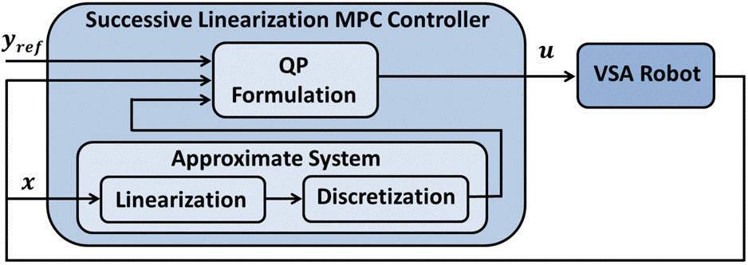
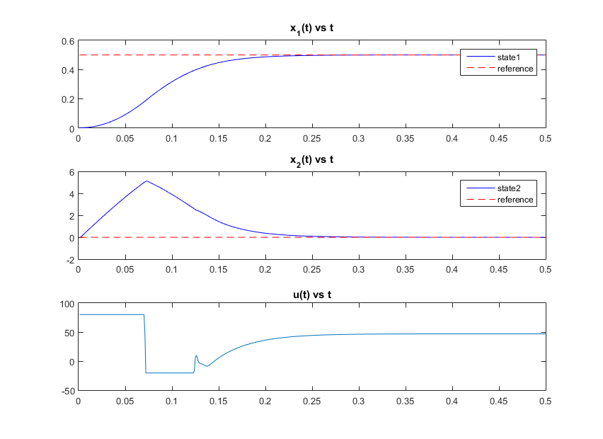

<link rel="stylesheet" href="/lmpc-matlab/assets/scripts/styles/default.css">

# Tutorial on Linearized MPC controller

This is a tutorial on the implementation of successive linearization based model predictive control in Matlab. This script shows how to implement the controller for a nonlinear system described by the differential equation 

\begin{align}
\dot{x} &= f(x,u) \newline
y&=Cx+Du
\end{align}

For details of derivation and background information, please refer to  Zhakatayey et al. "[Successive linearization based model predictive control of variable stiffness actuated robots.]( #citation)".

## Problem statement
MPC controller requires several parameters:

`np` - horizon length (number of time steps in the prediction horizon)

`Q`  - a weight matrix representing relative importance of states (also we use vector 'wx')

`R`  - a weight matrix penalizing large values of control inputs ( vector 'wu')

The general Model Predictive Control (MPC) can be formulated as an optimization problem with horizon length $$np$$:
 
$$ \min\limits_{ u } J = \frac{1}{2}(X-rr)^TQ(X-rr) + \frac{1}{2}u^TRu = \frac{1}{2}u^TGu + f^Tu + Constant $$

subject to:

$$ A_{con} u \leq B_{con}$$ 

$$ X = [x(1),x(2),...,x(np)]^T $$

$$ x(k+1) = f(x(k),u(k))$$

In order to solve this problem, we can use the built-in quadratic programmer `quadprog()` in Matlab. Please refer to  the documentation of `quadprog()` [function for details](https://www.mathworks.com/help/optim/ug/quadprog.html?requestedDomain=true).
In fact, any nonlinear optimization problem solver can be used to solve this problem. For example, qpOASES is suitable for real-time operation of control systems thanks to its ability to find solutions quickly.

## Block Diagram of the Successive Linearization Model Predictive Controller

## Tutorial objectives
This tutorial covers basic implementation of the SLMPC controller. This consists of:
1. [Linearization of model](https://en.wikipedia.org/wiki/Linearization) 
2. [Discretization of linearized model](https://en.wikipedia.org/wiki/Discretization)
3. Solving SL-MPC optimization problem with simple constraints

In this tutorial, we use a simple pendulum for the test case with the equation of motion:

$$\frac{\partial x_1}{\partial t} = x_2 $$ 

$$\frac{\partial x_2}{\partial t} = -\frac{g}{l} sin(x_1) -b*x_2 + u $$

Following MATLAB code shows our implementation:

<pre>
<code class="matlab">
close all; clear; clc;
% global parameters associated with dynamic model of the system 
sys.g = 9.81;
sys.l = 0.1;
sys.b = 0.2;
% this is matrices to represent output as y=C*x+D*u
C = eye(2);  
D = [0;0];
%initial point of states
x = [0.001; 0];
%control input max and min values
ui=0;
umax = 80;
umin =-20;
% IMPORTANT PARAMETERS
np = 40;       % horizon length 
nx = 2;        % number of states 
nu = 1;        % number of inputs
no = size(C,1);% number of outputs
Ts = 0.001;    % step size
Tfinal = 0.5;  % final time
wx = [1000 1]; % relative importance of states
wu = 0.00001;  % penalizing weights of control inputs
% generating simple step reference of the form [0.5 ; 0] 
ref =0.5*[ones(1,Tfinal/Ts +np);zeros(1,Tfinal/Ts +np)];
% model is anonymous function that represents the equation which describes 
% system dynamic model and in the form of dx/dt =f(x,u). 
model = @(x,u) <a href="https://github.com/ARMSLab/slmpc/blob/master/nonlin_eq.m">nonlin_eq</a>(x,u,sys); 
% FOR MPC CONTROLLER
rr = zeros(np*nx,1);
y  = zeros(no,Tfinal/Ts);
uh = zeros(nu,Tfinal/Ts);
%constraints for inputs in the whole horizon in the form of Acon*u <=Bcon
[Acon,Bcon] = <a href = "https://github.com/ARMSLab/slmpc/blob/master/simple_constraints.m">simple_constraints</a>(umax,umin,np,nu);
% weighting coefficient reflecting the relative importance of states and control inputs 
Q = diag(repmat(wx, 1, np)); 
R = diag(repmat(wu, 1, np));
% Setting the quadprog with 200 iterations at maximum
opts = optimoptions('quadprog', 'MaxIter', 200, 'Display','off');
% MAIN SIMULATION LOOP
for t=1:Tfinal/Ts
    
    rr = <a href="https://github.com/ARMSLab/slmpc/blob/master/ref_for_hor.m"> ref_for_hor</a>(rr,ref,t,np,nx);% reference vector for whole horizon  
    y(:,t) = C*x+D*ui;                % evaluating system output 
    [x, dx] = RK4(x,ui,Ts,model);     % i.e. simulate one step forward with Runge-Kutta 4 order integrator
    [A, B, K] = <a href="https://github.com/ARMSLab/slmpc/blob/master/linearize_model.m">linearize_model</a>(x,dx,ui,sys);                           % linearization step
    [Ad,Bd,Kd] = <a href= "https://github.com/ARMSLab/slmpc/blob/master/discretize.m">discretize</a>(A,B,K,Ts);                              % discretization step
    [G, f] = <a href = "https://github.com/ARMSLab/slmpc/blob/master/grad_n_hess.m">grad_n_hess</a>(R, Q, Ad, Bd, C, D, Kd, rr, np, x);        % calculating Hessian and gradient of cost function
    u = quadprog(G, f, Acon, Bcon, [], [], [], [], [],opts);
    ui = u(1:nu);     %providing first solution as input to our system
    uh(:,t) = ui;     %storing input
end
% plotting the results
tt = Ts:Ts:Tfinal;
subplot(3,1,1)
plot(tt ,y(1,:),'b', tt ,ref(1,1:(Tfinal/Ts)),'r--');
title('x_1(t) vs t');
legend('state1','reference');
subplot(3,1,2)
plot(tt ,y(2,:),'b',tt,ref(2,1:(Tfinal/Ts)),'r--');
legend('state2','reference');
title('x_2(t) vs t');
subplot(3,1,3)
plot(tt ,uh);
title('u(t) vs t');
</code>
</pre>

### Results
In figure below, results for the above code are shown. `x(1)` and `x(2)` are states of system described in [tutorial objectives]( #tutorial-objectives). The red dashed lines represent the desired reference for each state. The u(t) represents solution of MPC controller. 

## Citation
If you use our code we kindly ask to cite the following paper:
<table>

<tr valign="top">
<td align="right" class="bibtexnumber">
[<a name="zhakatayev2017successive">1</a>]
</td>
<td class="bibtexitem">
A.&nbsp;Zhakatayev, B.&nbsp;Rakhim, O.&nbsp;Adiyatov, A.&nbsp;Baimyshev, and H.&nbsp;A. Varol,
  &ldquo;Successive linearization based model predictive control of variable
  stiffness actuated robots,&rdquo; in <em>2017 IEEE International Conference on
  Advanced Intelligent Mechatronics (AIM)</em>, July 2017, pp. 1774--1779.
[&nbsp;<a href="/lmpc-matlab/assets/citation.bib">bib</a>&nbsp;| 
<a href="http://dx.doi.org/10.1109/AIM.2017.8014275">DOI</a>&nbsp;|&nbsp;<a href="http://arms.nu.edu.kz/sites/default/files/zhakatayev2017successive.pdf">PDF</a>&nbsp;]
</td>
</tr>
</table>

## Supplemental Information
This tutorial is a part of VSA project at (ARMS Lab)[http://arms.nu.edu.kz/]

If you spot a typo in the tutorial or bug in the source code, please contact us via email:  
Bexultan Rakhim (bexultan.rakhim [at] nu.edu.kz ) 
Olzhas Adiyatov (oadiyatov [at] nu.edu.kz ) 

or (file an issue)[https://github.com/ARMSLab/slmpc/issues/new] through GitHub.
